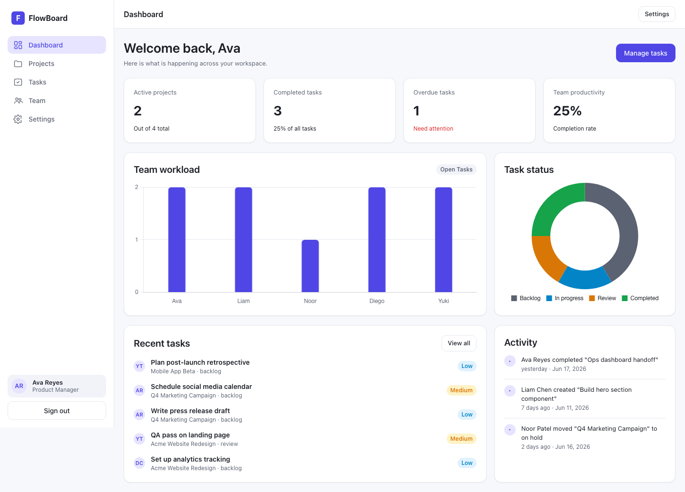
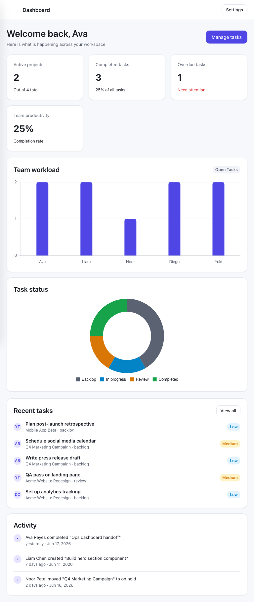
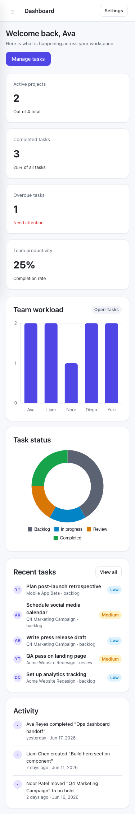
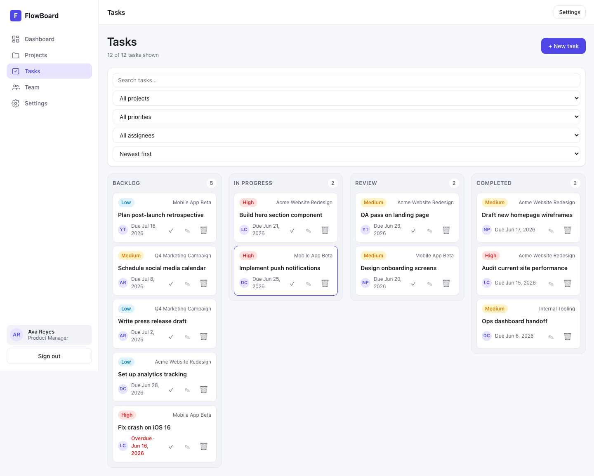
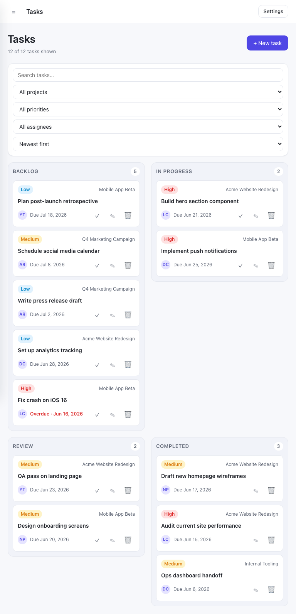
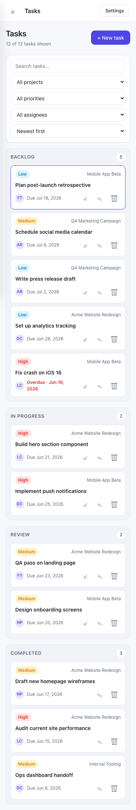
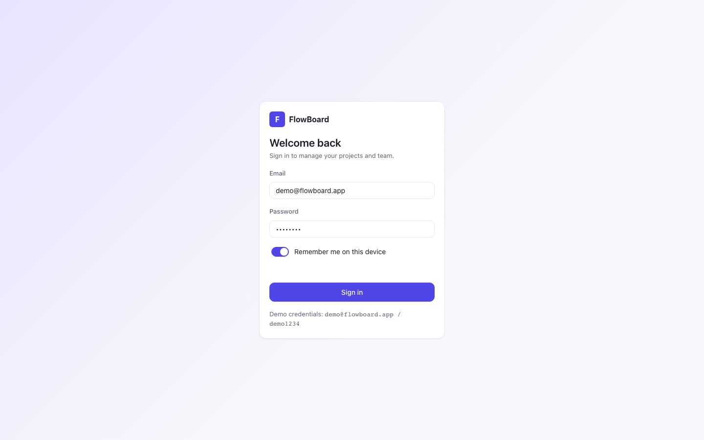
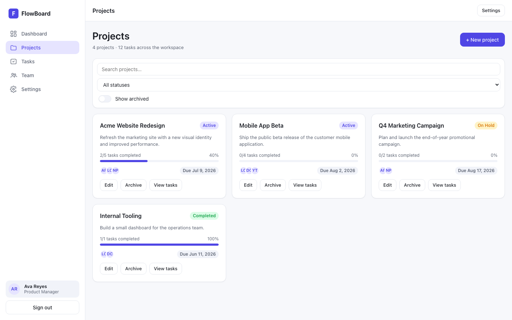
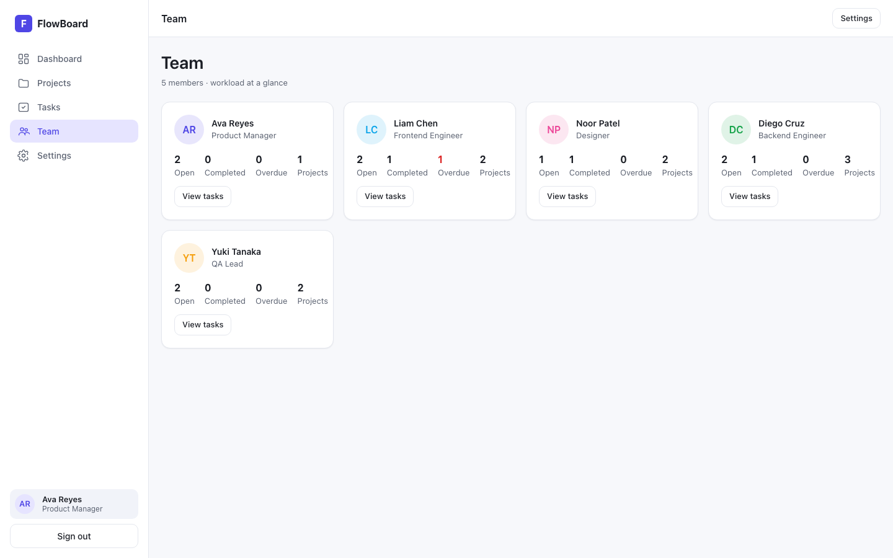
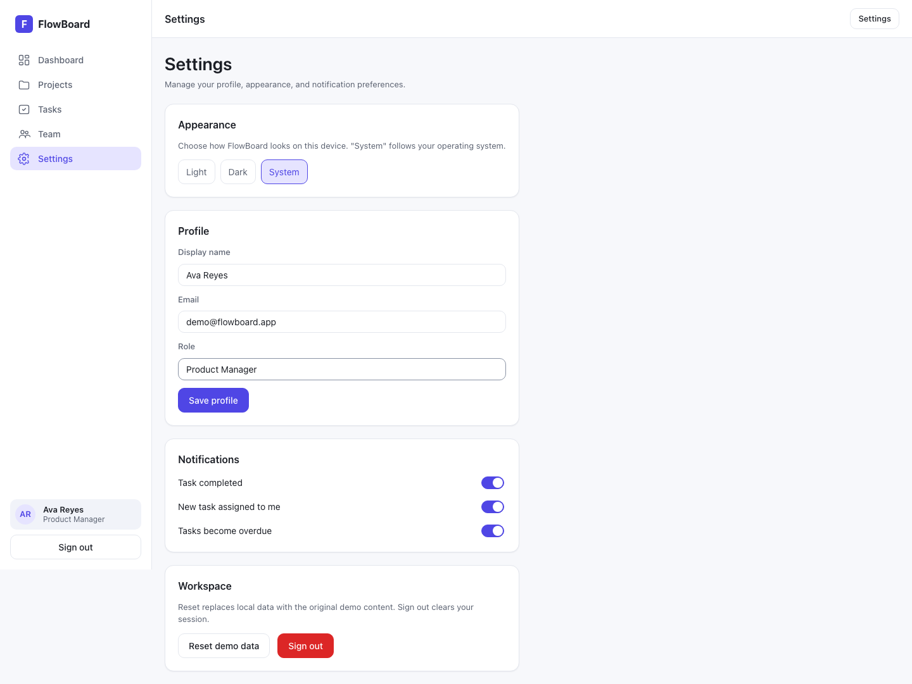

# FlowBoard

FlowBoard is a responsive task and project dashboard for small teams that need one place to see work in progress, manage priorities, and keep projects moving. It is a static frontend demo with realistic sample data, mock sign-in, drag-and-drop tasks, project tracking, team workload views, and settings that persist on the device.



## Links

| Resource | Status |
| --- | --- |
| Repository | <https://github.com/monev1905/flowboard> |
| Live demo | TBD |

## Highlights

- See the health of the workspace at a glance with project totals, completed work, overdue tasks, productivity, charts, recent tasks, and activity.
- Drag tasks between Backlog, In progress, Review, and Completed columns to update status immediately.
- Create, edit, archive, search, and filter projects with visible progress, due dates, and assigned team members.
- Filter and sort tasks by project, priority, assignee, due date, and search text.
- Review each team member's workload, completed work, overdue tasks, and project count.
- Switch between light, dark, and system themes, update the demo profile, and configure notification preferences.
- Use the same app comfortably on desktop, tablet, and phone layouts.
- Keep demo data and user preferences in `localStorage`, so changes survive a refresh without a backend.

## Screenshots

### Dashboard

| Desktop | Tablet | Mobile |
| --- | --- | --- |
|  |  |  |

### Task Board

| Desktop | Tablet | Mobile |
| --- | --- | --- |
|  |  |  |

### Main Workflow Screens

| Sign in | Projects | Team | Settings |
| --- | --- | --- | --- |
|  |  |  |  |

## Tech Stack

| Area | Implementation |
| --- | --- |
| Build tool | Vite 5 |
| Language | HTML, CSS, JavaScript ES modules |
| Charts | Chart.js |
| Drag and drop | SortableJS |
| Routing | Hash-based client-side routes |
| State | Small custom store persisted to `localStorage` |
| Styling | Hand-written CSS with design tokens |
| Test data | Local seed data in `src/data/seed.js` |

No backend is required. The production build is static and can be hosted from any static file platform.

## Getting Started

```bash
npm install
npm run dev
```

The dev server runs at `http://localhost:5173`.

```bash
npm run build
npm run preview
```

The preview server runs at `http://localhost:4173`.

To refresh the README screenshots after starting `npm run preview`:

```bash
npm run screenshots
```

## Demo Credentials

```text
email: demo@flowboard.app
password: demo1234
```

The login form is prefilled with the demo account.

## Feature Map

| PRD area | Implemented surface |
| --- | --- |
| Mock authentication | Sign-in screen, remembered session, sign out |
| Dashboard | KPI cards, workload chart, task status chart, recent tasks, activity feed |
| Project management | Project cards, create/edit modal, archive/delete flow, search and status filters |
| Task management | Kanban board, create/edit/delete modal, priority/status/assignee/due-date fields, search/filter/sort controls, drag-and-drop status changes |
| Team management | Member cards with roles, initials, open/completed/overdue/project counts |
| Notifications | Toasts for sign-in, project/task actions, profile and theme updates |
| Settings | Theme choice, profile editing, notification toggles, demo reset, sign out |
| Responsive design | Verified screenshot set at 1440x900, 768x1024, and 375x812 viewports |

## Architecture

```text
src/
  components/  layout, modal, toast, and chart helpers
  data/        seeded members, projects, tasks, and activity
  pages/       login, dashboard, projects, tasks, team, settings
  services/    auth, router, storage, store, theme
  styles/      tokens, base rules, components, responsive layout
  utils/       DOM helpers and formatting utilities
```

`src/main.js` wires together routing, authentication, theme preferences, and the app shell. Each page exports a render function that returns DOM nodes. State changes go through `src/services/store.js`, which writes JSON state to the `flowboard:` localStorage keys and notifies the active view to rerender.

## Quality Notes

- `npm run build` completes successfully and produces static files in `dist/`.
- The Vite build separates Chart.js and SortableJS into their own production chunks.
- Forms use labels, dialogs use modal roles, charts include image roles, and toast messages use a polite live region.
- Keyboard focus styling and reduced-motion rules are defined in the CSS.
- Preferences, session data, projects, tasks, and activity persist locally between refreshes.
- Real screenshots are stored in `docs/screenshots/` for desktop, tablet, and mobile review.

## Deployment

Build the app and upload the `dist/` folder to GitHub Pages, Netlify, Vercel, or another static host:

```bash
npm run build
```

`vite.config.js` uses `base: './'`, so the compiled app can run from a subdirectory as well as a domain root.

## Future Enhancements

- Connect the dashboard to a real backend and authenticated user accounts.
- Add calendar or Gantt views for deadline planning.
- Add file attachments and team discussion threads.
- Add a hosted demo URL, Lighthouse report, and short product walkthrough video.
